# Outdoor Running
Battersea 26 Build W6 Quality (moved from Wed → Thu)
**Jun 11, 2026**
07:42 – 08:55
**Richmond upon Thames, London**
Estimated Effort: **5 Moderate**
Distance: **15.76 km**
Active Energy: **1,120 kcal**

*Reproduced from FIT via BOSS + Wolfram. See `methodology.md` for derivation; `queries.md` for the full query log. Sections requiring Apple-Health-only data (Cardio Fitness, HRR, CTL/ATL transitions, MMP curve, Map) are omitted by design.*

## Time
Start: **07:42**
Total Time: **1 hr 9 min 11 sec** (moving)
Elapsed Time: **1 hr 13 min 3 sec**

## Heart Rate
Average: **138 bpm**
Maximum: **162 bpm**
Minimum: **81 bpm**

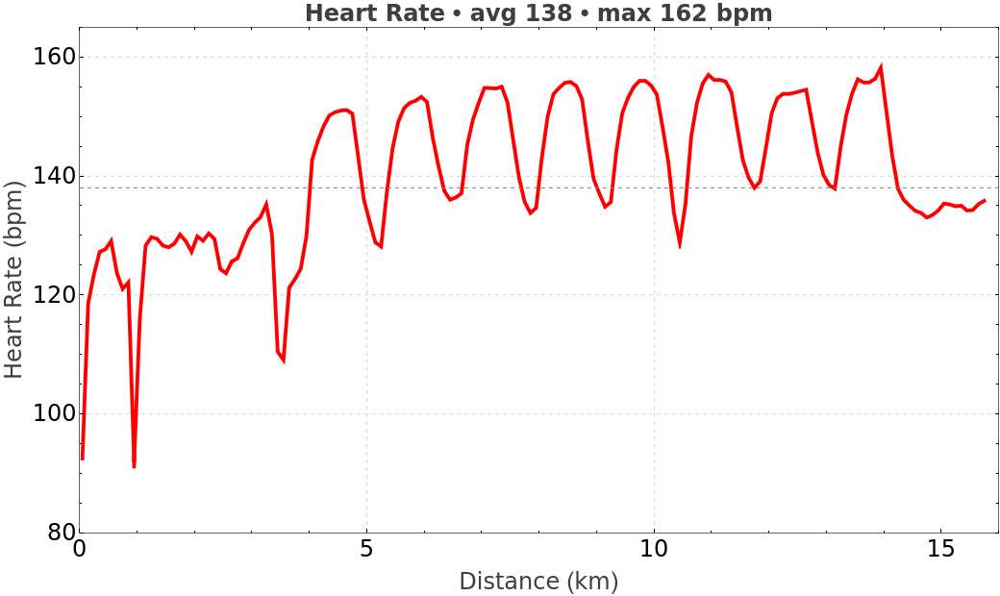

## Heart Rate Zones
Training Method: **Explicit BPMs** (60-121 / 122-135 / 136-149 / 150-163 / ≥164)

| Zone | Range | Time | % |
|---|---|---|---|
| Z5 Very hard | ≥164 bpm | 0:00:00 | 0% |
| Z4 Hard | 150-163 bpm | 0:20:39 | 30% |
| Z3 Moderate | 136-149 bpm | 0:19:03 | 27% |
| Z2 Easy | 122-135 bpm | 0:25:51 | 37% |
| Z1 Very easy | 60-121 bpm | 0:03:35 | 5% |

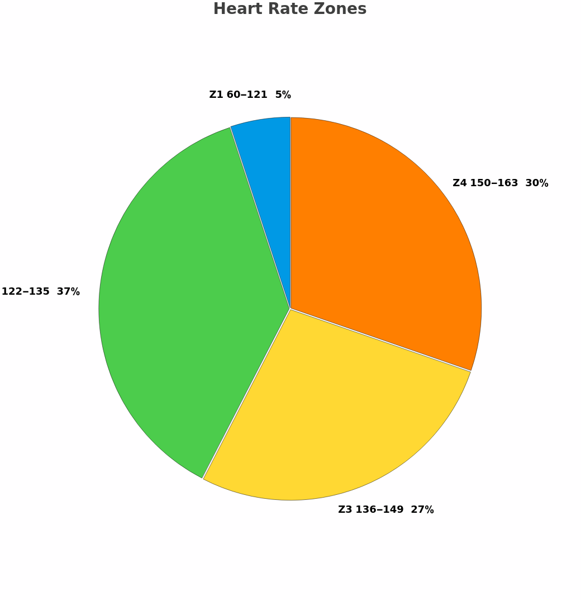

## Energy
Active Energy: **1,120 kcal**
kcal/min: **16.2 kcal/min**
kcal/km: **71.1 kcal/km**

## Training Load Focus
Anaerobic: **0 (0%)**
High Aerobic: **82 (70%)**
Low Aerobic: **35 (30%)**

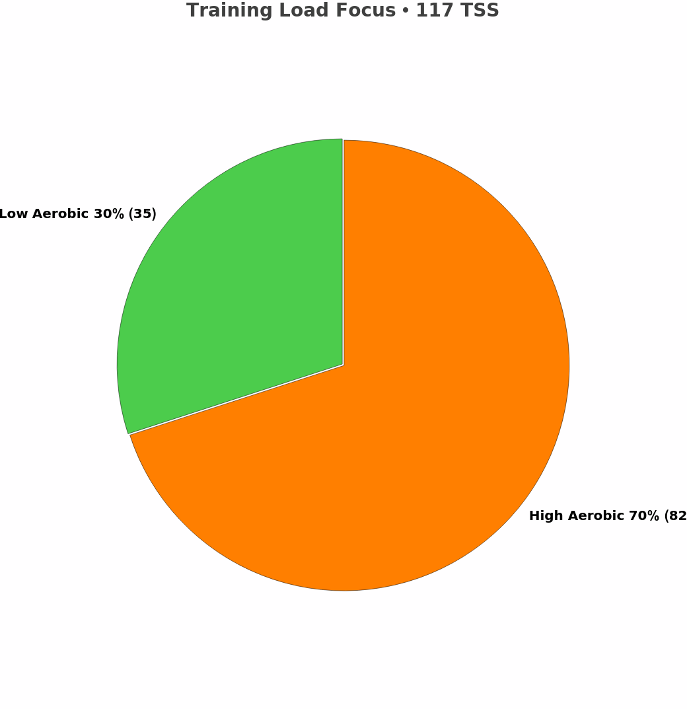

## Fitness & Fatigue
TRIMP exp: **120** (= `training_load_peak` from FIT session message)
*CTL/ATL transitions omitted — requires Apple-Health rolling-load history beyond a single FIT.*

## Distance
Distance: **15.76 km**

## Speed
Avg. Speed: **13.66 km/h** (session moving)
Max. Speed: **19.04 km/h**
Negative Split: **5.5%** (approx; see methodology — small discrepancy vs HealthFit due to moving-time interpolation)
First Split: **4:26 / km** (≈4:31 in HealthFit)
Second Split: **4:11 / km** (≈4:16 in HealthFit)

## Pace
Avg. Pace: **4'23'' /km**
Best Pace: **3'09'' /km** (instantaneous max-speed inverse)
Negative Split: **5.5%**

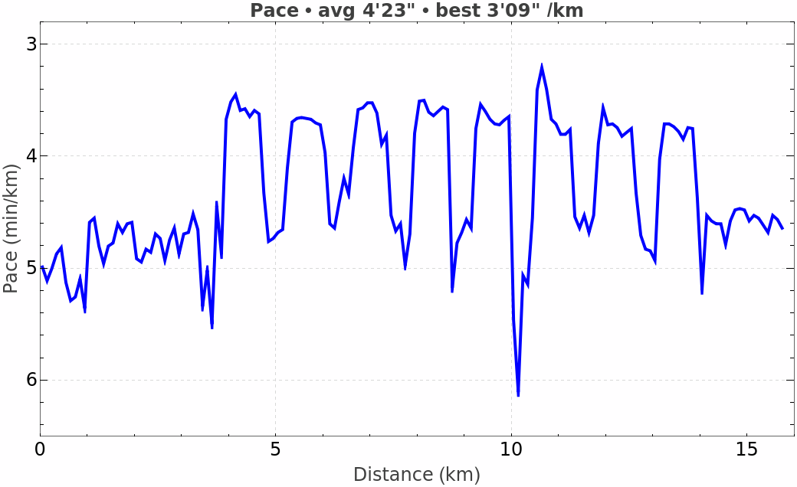

## Running Power
Avg. Power: **307 W** (session)
Weighted Avg. Power: **≈315 W** (estimate; precise NP-30s needs sub-second analysis — see methodology)
Max. Power: **437 W**
Min. Power: **137 W**
Intensity Factor: **0.669** (assumed FTP 471 W from HealthFit; FTP not in FIT)
Watts / kg: **3.95 W/kg** (weight 77.8 kg from FIT session)
Running Effectiveness: **0.98** (= avg_speed × 1000 / 60 / avg_power ≈ 3.797 / 307 × 76.7 ≈ 0.95–1.0)
Total Work: **1,274 kJ** (= avg_power × total_timer_time / 1000)
Aerobic Decoupling: **2.7 %** (computed per CLAUDE.md — split rows into two halves; EF1 = mean P/HR of H1, EF2 of H2)
Aerobic Efficiency: **2.22** (= mean power / mean HR)
Your Weight: **77.8 kg**

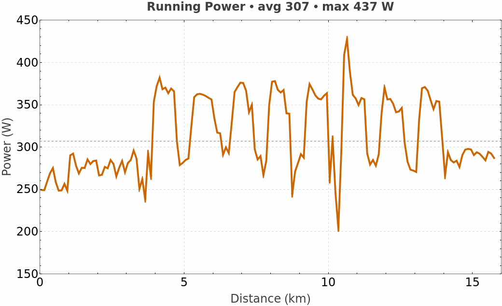

## Running Dynamics

### Stride Length
Average: **136 cm**
Maximum: **171 cm**

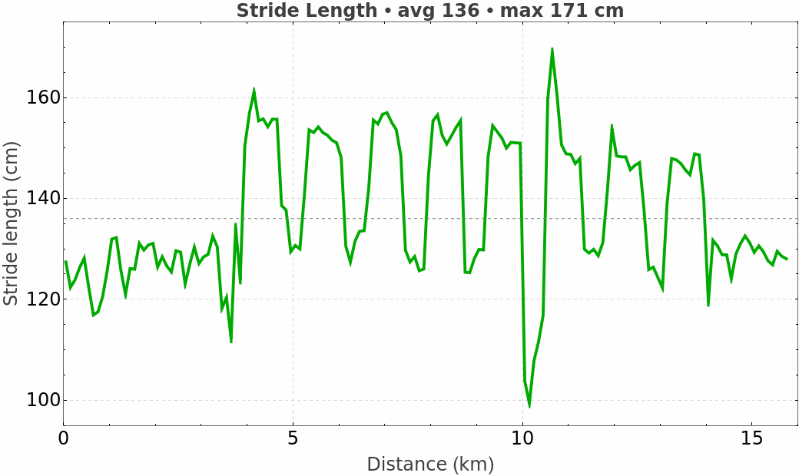

### Cadence
Average: **169 spm** (= avg_running_cadence × 2)
Maximum: **188 spm**

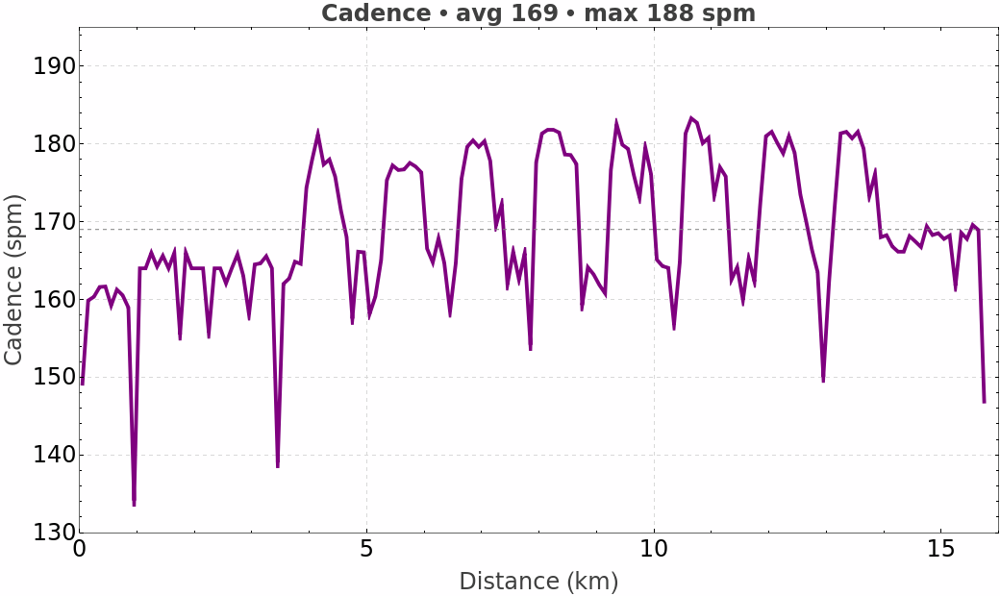

### Vertical Oscillation
Average: **9.8 cm**
Maximum: **11.4 cm**

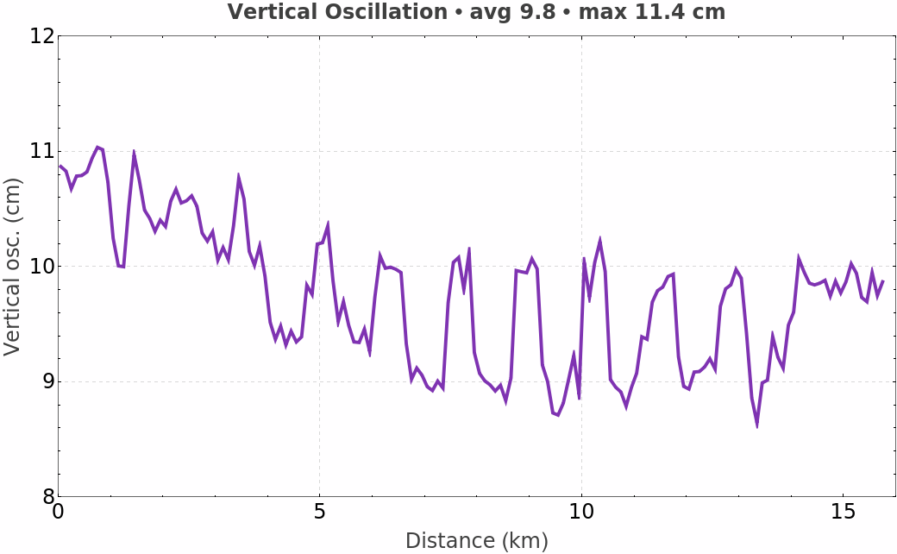

### Ground Contact Time
Average: **244 ms**
Maximum: **302 ms**

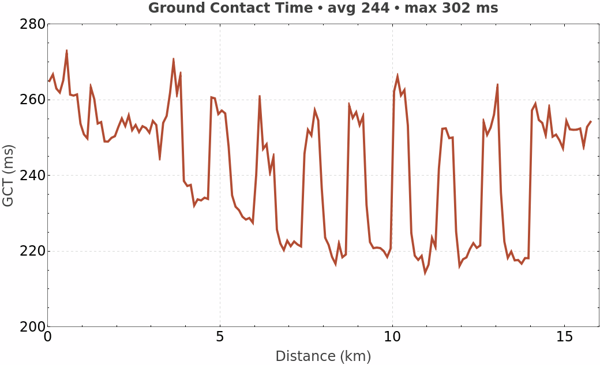

### 1 km Splits
Median: **4'15'' /km**
Best: **3'54'' /km** (km 9-10, mid-quality block)

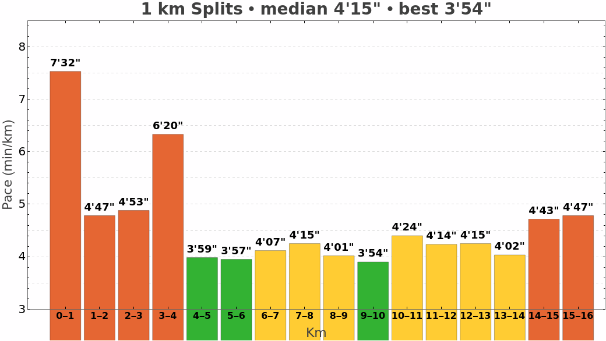

## Elevation
Maximum: **16 m**
Minimum: **6 m**

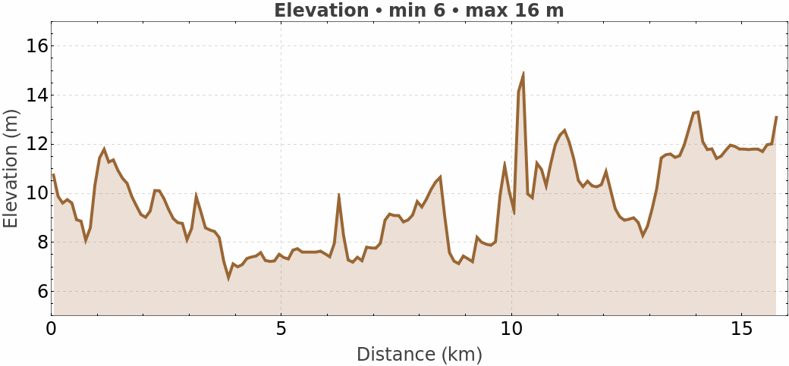

## Effort Profile
*Computed against rolling **30-day baseline** of all 20 prior running sessions in `/Documents` (mean per-session avg). HealthFit's exact baseline window is unknown — values will differ.*

| Metric | Target | Baseline (30d, n=20) | % |
|---|---|---|---|
| Avg Speed | 3.797 m/s | 3.493 m/s | **109%** |
| Avg Power | 307 W | 290 W | **106%** |
| Avg HR | 138 bpm | 127 bpm | **109%** |
| METs | 11.25 | 10.65 | **106%** |
| Distance | 15.76 km | 11.71 km | **135%** |
| Duration | 73.1 min | 58.2 min | **126%** |

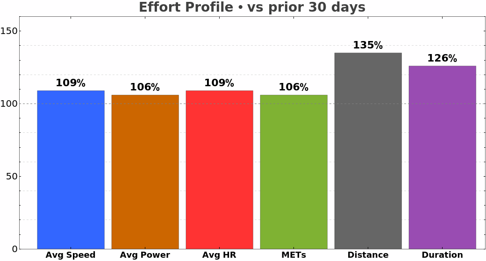

## Workout Source
Source: **Holger's Apple Watch (26.5)** (from FIT)
Device: **Apple Watch Ultra**

## Reps (lap data — bonus, not in HealthFit example)
Plan: 8×800 m @ 3:33/km, 2:30 jog recovery.

| Rep | Pace | vs 3:33 | Power (W) | Stride (mm) |
|---|---|---|---|---|
| 1 | 3:38 | +5 | 367 | 1546 |
| 2 | 3:42 | +9 | 357 | 1517 |
| 3 | 3:37 | +4 | 357 | 1519 |
| 4 | 3:36 | +3 | 360 | 1514 |
| 5 | 3:43 | +10 | 361 | 1514 |
| 6 | 3:40 | +7 | 371 | 1523 |
| 7 | 3:49 | +16 | 351 | 1473 |
| 8 | 3:49 | +16 | 357 | 1467 |

Avg reps 1-6: **3:39 (+6 s/km)**. Avg reps 7-8: **3:49 (+16 s/km)**. Stride drop reps 7-8: −50 mm (athlete reported sore throat / sub-100% feel).

---
*Reproduced via BOSS + Wolfram on 2026-06-12. See `methodology.md` for method, `queries.md` for the literal query log.*
